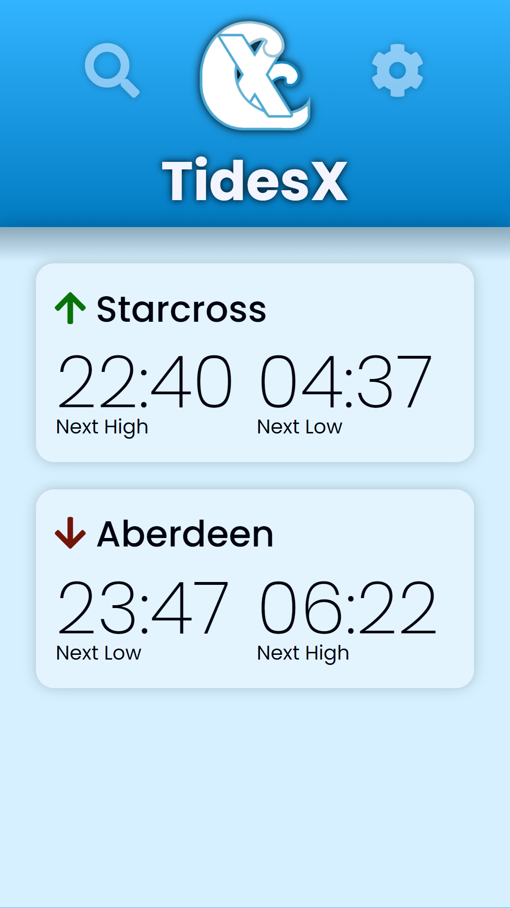
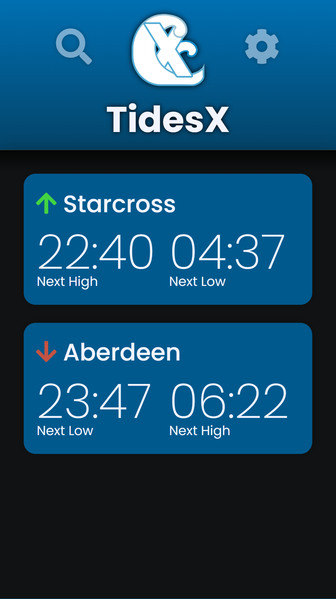
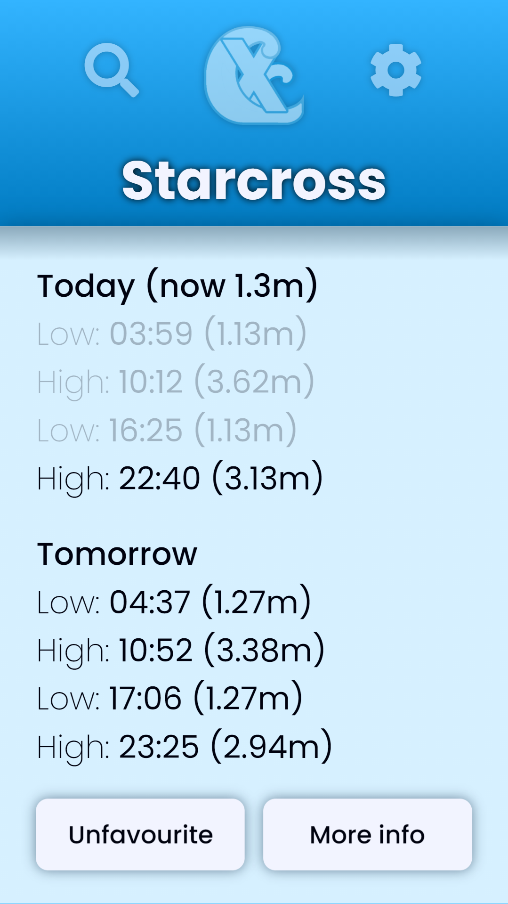
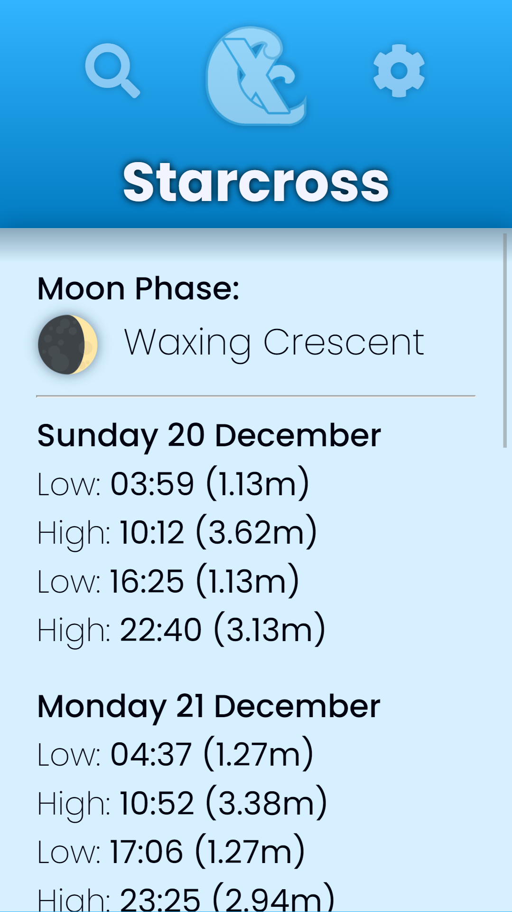
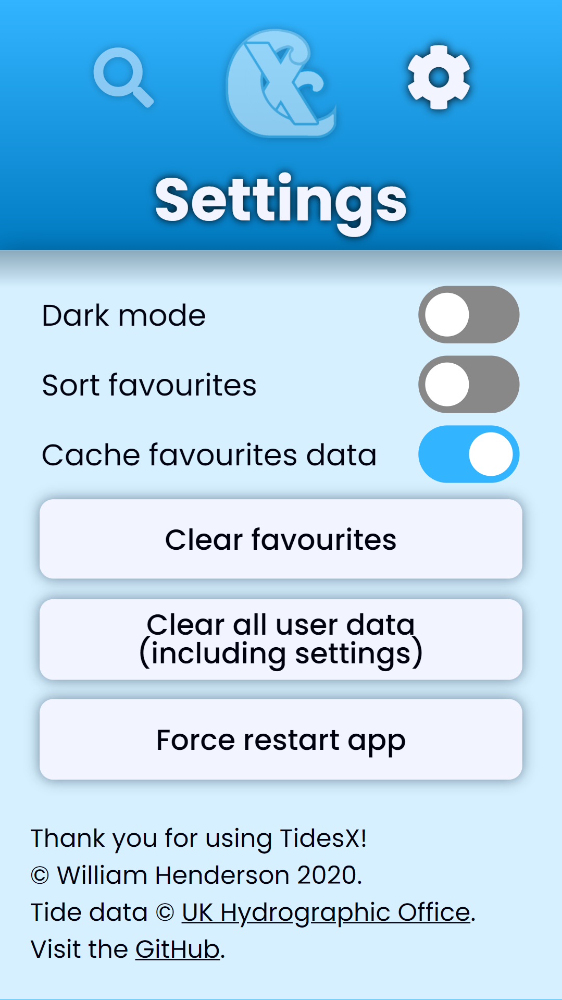

# TidesX
A quick and easy way to check the tide times.

## What is TidesX?
TidesX is an intuitive and easy-to-use web app for checking the tide times anywhere in the UK. It features predictions and current information for over 600 coastal locations, taken straight from the UK Hydrographic Office.

## Sounds good, where can I get it?
TidesX is now available on the [Google Play Store](https://play.google.com/store/apps/details?id=com.whenderson.tidesx) for Android devices! If you have an iOS device, TidesX is available on GitHub Pages, where you need to install it as a web app. This means opening it in your browser [here](https://w-henderson.github.io/TidesX), then adding it to your home screen.

# Screenshots
| | | |
|:-------------------------:|:-------------------------:|:-------------------------:|
|  |    |  |
|  |    |  |