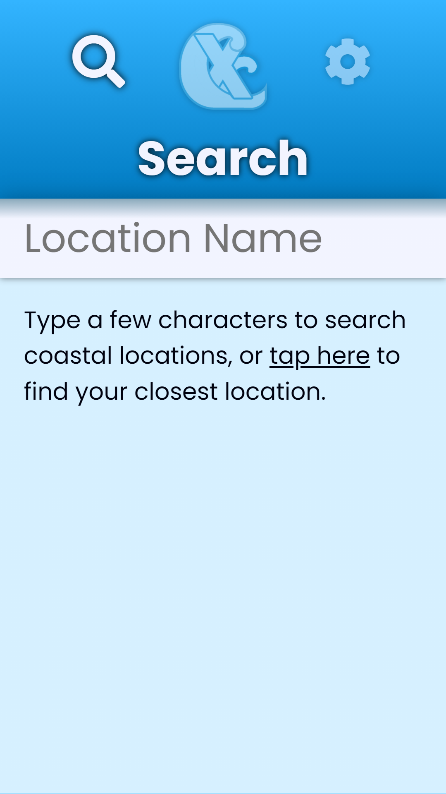

# TidesX
A quick and easy way to check the tide times.

## What is TidesX?
TidesX is an app to check the tide times. It has a clean and beautiful interface and intuitive design, so the information you need is never more than a tap away.

## Where does TidesX get its data from?
Originally, I planned for TidesX to get its data from the UK Hydrographic Office, but it turns out that's a lot harder (and more expensive) than I anticipated! At the moment, it uses [TideTimes.org.uk](https://tidetimes.org.uk), which doesn't offer an API so it literally scrapes the page. It's fast and reliable, but not ideal. If you can find a free tide times API with reasonably generous limits, please do implement it and open a pull request, or even just let me know in an issue.

## Sounds good, where can I get it?
TidesX is available on GitHub Pages, where you need to install it as a web app. This means opening it in your browser [here](https://w-henderson.github.io/TidesX), then adding it to your home screen.

# Screenshots

