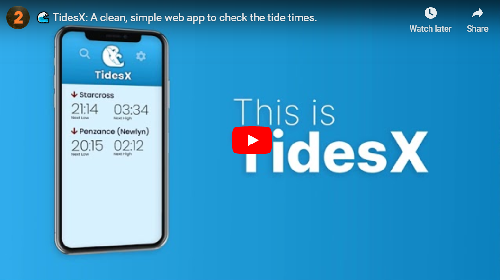

# TidesX
A quick and easy way to check the tide times.

## What is TidesX?
TidesX is an app to check the tide times. It has a clean and beautiful interface and intuitive design, so the information you need is never more than a tap away.

## Where does TidesX get its data from?
TidesX gets its data directly from the UK Hydrographic Office through their Admiralty API. It's limited to 20k requests per month, but I'd be surprised if we ever meet that limit.

## Sounds good, where can I get it?
TidesX is available on GitHub Pages, where you need to install it as a web app. This means opening it in your browser [here](https://w-henderson.github.io/TidesX), then adding it to your home screen.

# Screenshots
| | | |
|:-------------------------:|:-------------------------:|:-------------------------:|
|  |    |  |
|  |    |  |